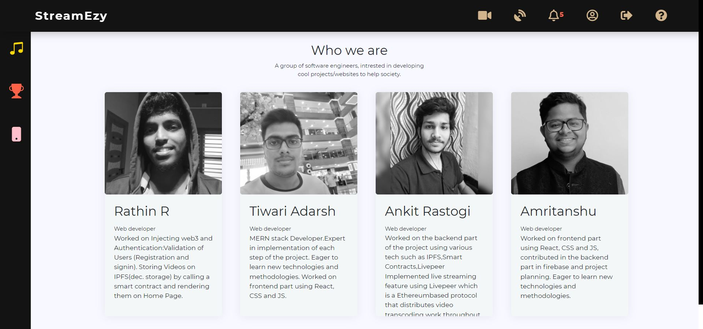

[![Contributors][contributors-shield]][contributors-url]
[![Forks][forks-shield]][forks-url]
[![Stargazers][stars-shield]][stars-url]
[![Issues][issues-shield]][issues-url]
[![LinkedIn][linkedin-shield]][linkedin-url]

 

<h1 align="center">
   
  
</h1>

<h1 align="center"> 
 <b> StreamEzy </b> 
 </h1> 

<h4 align="center"> 🖥️ Decentralized Live Video Streaming Platform 🎞️</h4> 
<h3 align="center"><a href='https://streamzy-development.web.app/' target='blank'>https://streamzy-development.web.app/</a></h3>

<h1 align="center">
   
  <a href="https://github.com/tiwariadarsh/StreamEzy">View demo</a>
  .
    <a href="https://github.com/tiwariadarsh/StreamEzy/issues">Report Bug</a>
    ·
    <a href="https://github.com/tiwariadarsh/StreamEzy/issues">Request Feature</a>
</h1>

## 🤖 About

<table>
<tr>
<td>
  
**StreamEzy** is a decentralized video streaming platform, deployed using
the **Ethereum network**. To host a website a developers/clients have to pay
a huge amount of money for the server. We aim to **minimize the cost** by
using decentralized storage which is based on **IPFS protocol** for storing
and sharing the data in a distributed file system.
Content creators can stream flawlessly and at a **bare minimum cost** called
Gas Fees for using the network. Streamers can claim almost all of the
super chats made to them by their fans and supporters as we have made
provisions for payment in crypto currency. This **prevents any third party
interruption** like banks or government.
   
    
<tr>
  <td>
    <b> The system would solve the following problems:     </b> 
    
It aims to **increase the reliability of video streaming** while **reducing the
costs** associated with it.
To achieve this we are building a P2P infrastructure that interacts through
      a Market place **secured** by blockchain. 
     
     
  </td>
  </tr>
</td>
</tr>
</table>

## :computer: Languages, Technologies and Framework 

<code></code>
  <code></code>
<code> </code>
  <code></code>
  <code></code>
   

  

   <code></code> 
   <code></code>
  <code></code>
<code></code> 
<code></code>  
   

  

  <code></code>
  <code></code>
 

 
 ## Metamask not found?
 

 
## Design
### Landing Page

### User Register

### Login

### View Video

### Like, Share, Comment and Subscribe

### Upload Video

### Go Live

### Profile

### Videos uploaded by user

### Edit your details

### About Us

## License

(<a href="#top">back to top</a>)

[contributors-shield]: https://img.shields.io/github/contributors/tiwariadarsh/StreamEzy.svg?style=for-the-badge
[contributors-url]:  https://github.com/tiwariadarsh/StreamEzy/graphs/contributors
[forks-shield]: 	https://img.shields.io/github/forks/tiwariadarsh/StreamEzy.svg?style=for-the-badge
[forks-url]: https://github.com/tiwariadarsh/StreamEzy/
[stars-shield]: https://img.shields.io/github/stars/tiwariadarsh/StreamEzy.svg?style=for-the-badge
[stars-url]:  https://github.com/tiwariadarsh/StreamEzy/stargazers
[issues-shield]: https://img.shields.io/github/issues/tiwariadarsh/StreamEzy.svg?style=for-the-badge
[issues-url]: https://github.com/tiwariadarsh/StreamEzy/issues
[license-shield]: https://img.shields.io/github/license/tiwariadarsh/StreamEzy?style=for-the-badge
[license-url]: https://github.com/tiwariadarsh/StreamEzy/blob/master/LICENSE.txt
[linkedin-shield]: https://img.shields.io/badge/-LinkedIn-black.svg?style=for-the-badge&logo=linkedin&colorB=555
[linkedin-url]:https://www.linkedin.com/in/rathin-r-3bb5341ba/
